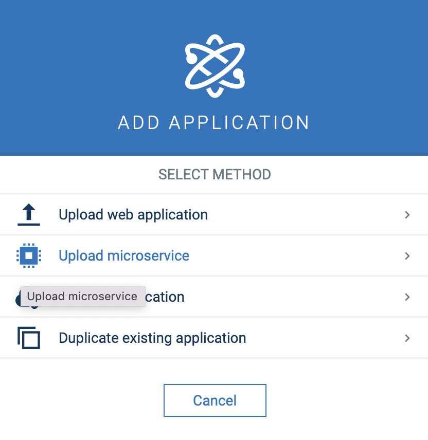

# Intro

This project is an example LPWAN decoder microservice in python that decodes a Base64 Hex payload, handles device creation and adds measurements.

# Content
- [Intro](#intro)
- [Content](#content)
- [Quick Start Example](#quick-start-example)
- [Solution components](#solution-components)
- [Installation from scratch](#installation-from-scratch)

# Quick Start Example
Use the provided zip here in the release and upload it as microservice. Send example payload to the decode endpoint of the service:
  `{
	"payload": "KQUgAXgqAO8DOP//"
}`

There is one device being created and the decoded measurements will be attached.

# Solution components

The microservice consists of 4 modules and a main runtime:
* `main.py`: Main runtime that opens an health endpoint at /health and also triggers the request of decoding on /decode endpoint
* `API/authentication.py`: Contains the Authentication class that requests the service user via the bootstrap user from within the microservice environment. See [documentation](https://cumulocity.com/guides/microservice-sdk/concept/#microservice-bootstrap) for more details.
* `API/inventory.py`: Consists of the logic to deliver the internalId of the device representation of the tenant or creates the device if a new one appears.
* `API/measurment.py`: Creates the measurement payload and sends it to Cumulocity.
* `decoder.py`: Contains the decoding logic.

# Installation from scratch

To build the microservice run:
```
docker buildx build --platform linux/amd64 -t {NAMEOFSERVICE} .
docker save {NAMEOFSERVICE} > image.tar
zip {NAMEOFSERVICE} cumulocity.json image.tar
```

You can upload the microservice via the UI or via [go-c8y-cli](https://github.com/reubenmiller/go-c8y-cli)

<br/><br/>
<p style="text-indent:30px;">
  <a>
  <center>
    
  </center>
  </a>
</p>
<br/>

------------------------------

These tools are provided as-is and without warranty or support. They do not constitute part of the Software AG product suite. Users are free to use, fork and modify them, subject to the license agreement. While Software AG welcomes contributions, we cannot guarantee to include every contribution in the master project.
_____________________
For more information you can Ask a Question in the [TECHcommunity Forums](http://tech.forums.softwareag.com/techjforum/forums/list.page?product=cumulocity).

You can find additional information in the [Software AG TECHcommunity](http://techcommunity.softwareag.com/home/-/product/name/cumulocity).